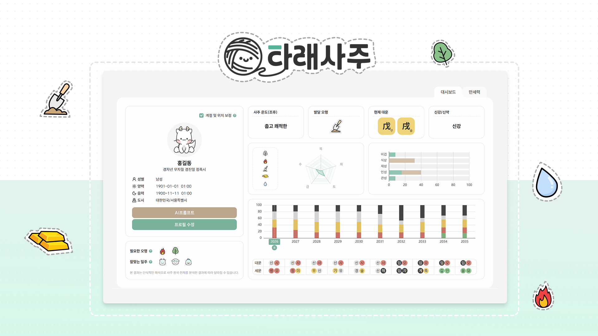

# 만세력 프로그램 taraesaju


<br><br>

# 프로젝트 소개

생년월일 기반 사주 데이터를 조후, 오행, 십신 구조로 수치화하고, 이를 차트 기반 시각화를 통해 분석하는 **만세력 데이터 대시보드**

### 🗝️ Key Features

- 만세력 기반 원국 분석
- 오행 / 십신 / 조후 수치화
- 대운 & 세운 기반 10년 흐름 분석
- 과다/결핍 및 신강/신약 진단
- 단순한 만세력이 아닌 정보를 수치화하여 이해를 도움
- <br><br>

# 개발 환경


<br><br>

# 프로젝트 구조

```

```

<br><br>

# 개발 기간 및 작업 관리

<br><br>

# 주요 기능

<br><br>
