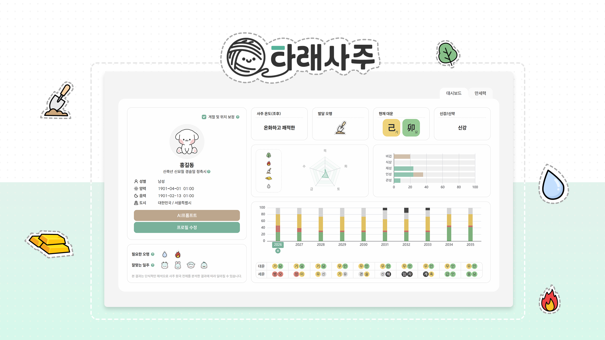

# 만세력 프로그램 taraesaju


<br><br>

# 프로젝트 소개

생년월일 기반 사주 데이터를 조후, 오행, 십신 구조로 수치화하고, 이를 차트 기반 시각화를 통해 분석하는 **만세력 데이터 대시보드**

26.04 ~ 26.06

### 🗝️ Key Features

- 만세력 기반 원국 분석
- 오행 / 십신 / 조후 수치화
- 대운 & 세운 기반 10년 흐름 분석
- 과다/결핍 및 신강/신약 진단
- 단순한 만세력이 아닌 정보를 수치화하여 이해를 도움
- <br><br>

# 개발 환경


<br><br>

# 프로젝트 구조

```
/frontend
  ├── /app
  │     ├── /(main)
  │     │   ├── /dashboard
  │     │   ├── /manseryeok
  │     │   └── layout.tsx
  │     │
  │     ├── /@modal
  │     ├── /api
  │     ├── /info
  │     └── layout.tsx
  │     └── page.tsx
  ├── /common
  │     ├── /component
  │     ├── /const
  │     ├── /lib
  │     ├── /type
  │     ├── /util
  ├── /public
  │     ├── /favicon
  │     ├── /fonts
  │     ├── /svg
  ├── /server
  │     ├── /data
  │     │   └── division24.json
  │     │   └── region.json
  │     ├── /service
  │     │   └── birthDataServerService.tsx
  │     │   └── luckyDataServerService.tsx
  ├── /client
  │     └── birthDataService.tsx
  │     └── ohaengDataService.tsx
  │     └── regionService.tsx
  ├── /style
  │     └── font.css
  │     └── global.css
```

<br><br>

# 주요 기능

[사용자 정보 입력]

사용자의 생년월일시와 출생지를 입력받아 사주 데이터를 생성합니다.

**구현 내용**

- react-hook-form 기반 입력 폼 구성
- 생년월일 및 시간 입력에 대한 유효성 검증 (조회버튼 클릭 시 검증)
- 출생지의 위도·경도 정보를 조회하여 태양시 계산에 활용

[대시보드 - 계절 및 위치 보정]

사주 원국의 오행 구조를 데이터 기반으로 시각화하고, 계절 및 위치 보정 여부에 따른 변화를 비교할 수 있습니다.

**구현 내용**

- 오행 분포를 차트 형태로 시각화
- 월지(계절)와 시지(시간)의 영향력을 가중치로 반영
- 체크박스를 통해 보정 전/후 결과를 실시간 비교
- 오행 균형도 및 강약 구조 분석

[대시보드 - AI프롬프트]


**구현 내용**

- 사주 원국 데이터 자동 정리
- 오행, 십신, 조후, 신강약 등의 핵심 정보 추출
- 복사 가능한 AI 프롬프트 제공
- 다양한 AI 서비스에서 바로 활용 가능

[만세력]


**구현 내용**

- 사주팔자(연주·월주·일주·시주) 표시
- 천간·지지 및 오행 정보 제공
- 십성, 십이운성, 신살 정보 제공
- 합, 충, 형, 파, 해 등 주요 관계 분석
- 대운 및 세운 정보 조회
